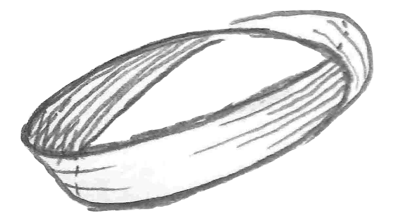

---
# Feel free to add content and custom Front Matter to this file.
# To modify the layout, see https://jekyllrb.com/docs/themes/#overriding-theme-defaults

layout: page
---

<figure>
  
  <figcaption text-align="right">Nastro di Möbius (<a href="http://www.math.lsa.umich.edu/~rlg/images/mathforkidsimages/moebiusstrip.jpg">immagine originale</a>)
  </figcaption>
</figure>
